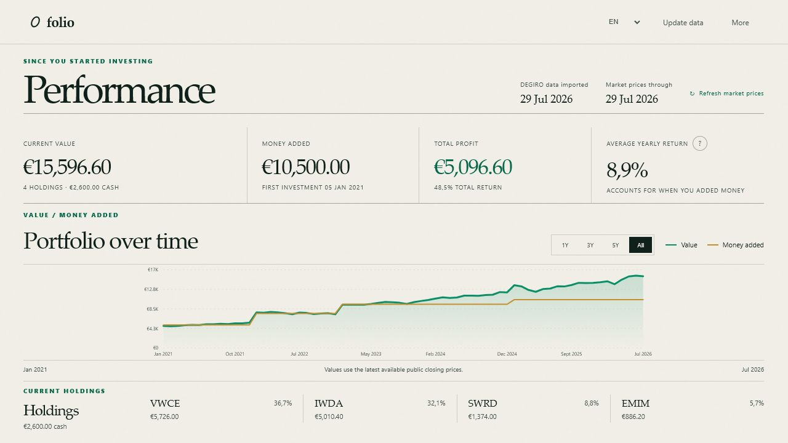
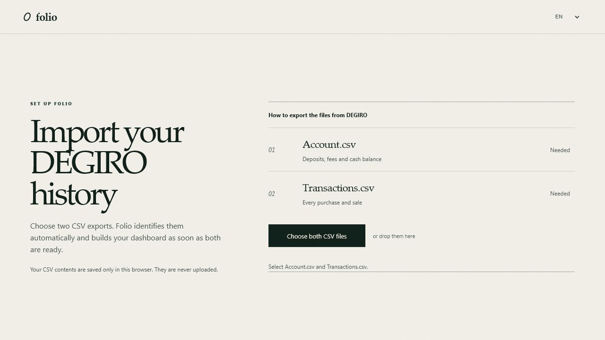
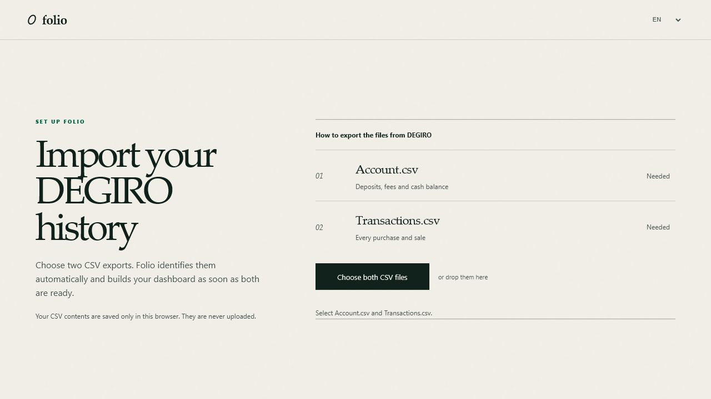

# Folio

Folio is an unofficial, multilingual, local-first performance dashboard for
DEGIRO CSV exports. It reconstructs a portfolio from account and transaction
history without sending those files to a remote service.



The repository images and walkthrough use synthetic data.



## What it shows

- Current portfolio value
- Net money added and total profit
- Money-weighted average yearly return (XIRR)
- Portfolio value and contributions over time
- Current holdings and allocation
- Data-freshness and import warnings

Folio supports English, Dutch, French, and German. The interface follows the
browser language by default, and the language can be changed from the header.
Localized DEGIRO column names and common deposit and withdrawal descriptions are
recognized automatically.

## Requirements

- Node.js 18 or newer
- A modern browser
- Full-history Account and Transactions CSV exports from DEGIRO

Folio has no third-party runtime packages, build step, or database.

## Run locally

From the project directory:

```powershell
npm start
```

Open [http://127.0.0.1:4173](http://127.0.0.1:4173).

No `npm install` step is required. To use another port:

```powershell
$env:PORT=8080
npm start
```

## Import DEGIRO data

1. In DEGIRO, open **Inbox → Account statement**.
2. Select the complete period since the account was opened and export CSV.
3. Open **Inbox → Transactions**.
4. Select the same complete period and export CSV.
5. In Folio, select both files together.

Filenames do not matter. Folio identifies each export from its columns and builds
the dashboard as soon as both files are valid. Portfolio.csv is not used.



DEGIRO documents its reports in its
[export guide](https://www.degiro.com/uk/helpdesk/tax/tax-treaties/which-reports-are-there-and-where-can-i-find-them).

## Updating

**Update data** replaces the previous CSV pair; it does not merge old and new
rows. Export both reports again using their complete date range. The existing
dashboard remains visible until the new pair is valid.

Rows repeated between the old and new exports are therefore not duplicated.
Potential duplicate rows inside a single Transactions.csv are retained and shown
as a warning so Folio never silently deletes a legitimate execution.

Other controls:

- **Refresh market prices** bypasses the normal freshness check.
- **More → Download data** downloads the calculated model as JSON.
- **More → Remove saved data** deletes the CSV contents stored by this browser.

## Privacy and network access

The imported CSV contents are parsed and stored in browser storage. They are not
sent to the Node server. The browser sends only known market symbols and a date
range to the server.

The server:

- binds only to `127.0.0.1`;
- requests public daily closing prices from Yahoo Finance;
- stores normalized responses under `.cache/prices/`;
- reuses a complete cache for 12 hours;
- refreshes only the latest missing portion of stale histories;
- spaces requests out and retries temporary rate limits on an alternate host;
- falls back to stale cached prices when the market source is unavailable.

The `.cache/` directory is excluded from Git. No third-party market-price data is
distributed in this repository.

Yahoo Finance is currently a convenient, no-key source rather than a documented
service contract. The provider is isolated in
`server/market/yahoo-provider.mjs` so it can be replaced without changing the
portfolio engine.

## Calculation model

1. Account rows provide deposits, withdrawals, and historical cash balances.
2. Transaction rows reconstruct the quantity held for each ISIN on each date.
3. Daily public closes value those quantities.
4. USD positions are converted with the historical EUR/USD close.
5. History contains the first transaction, every month end, and today.
6. Profit is portfolio value minus net money added.
7. Average yearly return uses external cash-flow timing in an XIRR-style
   calculation.

Public closes can differ from values displayed by DEGIRO. Folio is intended as a
personal overview, not tax, accounting, trading, or investment advice.

## Supported instruments

| Short name | Instrument | Market symbol |
| --- | --- | --- |
| IWDA | iShares Core MSCI World | `IWDA.AS` |
| EMIM | iShares Core MSCI Emerging Markets IMI | `EMIM.AS` |
| SWRD | SPDR MSCI World | `SWRD.AS` |
| VWCE | Vanguard FTSE All-World | `VWCE.DE` |
| AMC | AMC Entertainment | `AMC` |

An unmapped ISIN is omitted from valuation and produces a warning. Add a mapping
to `public/js/core/instruments.js` and allow the corresponding symbol in
`server.mjs`.

## Known limitations

- Export translations are based on known English, Dutch, French, and German
  column and description variants. DEGIRO may introduce other wording.
- Instrument-to-market-symbol mapping is currently explicit rather than
  automatic.
- Corporate actions or transferred securities not represented in
  Transactions.csv may need additional handling.
- Browser storage capacity varies. Very large exports can exceed its quota.
- Market data comes from an unofficial Yahoo Finance endpoint and may change.

## Project structure

```text
degiro-dashboard/
├── docs/assets/                    Synthetic screenshots and walkthrough
├── public/
│   ├── index.html                  Semantic page structure
│   ├── js/
│   │   ├── app.js                  Application coordination
│   │   ├── i18n.js                 Interface translations
│   │   ├── core/                   Pure parsing and portfolio calculations
│   │   ├── services/               Browser storage and market requests
│   │   └── ui/                     Imports, dashboard, chart, and feedback
│   └── styles/                     Base, import, dashboard, and responsive CSS
├── server/
│   ├── market/                     Provider, persistent cache, and refresh policy
│   └── static-files.mjs            Static-file security and content types
├── test/
│   ├── fixtures/                   Synthetic DEGIRO exports
│   └── *.test.js                   Parser, portfolio, and cache tests
├── server.mjs                      Local HTTP entry point
├── LICENSE                         MIT license
└── package.json                    Run and validation commands
```

The modules under `public/js/core/` do not access the DOM, browser storage, or
network. Market providers and caching are similarly isolated on the server.

## Development

Run all checks:

```powershell
npm run check
```

Run tests only:

```powershell
npm test
```

The test suite covers localized exports, European and English number formats,
deposits, withdrawals, buys, complete sales, USD conversion, unknown
instruments, duplicate detection, invalid exports, cache freshness, incremental
refresh, and offline cache fallback.

There is no transpiler or bundler. Refresh the page after changing HTML, CSS, or
browser JavaScript.

## Troubleshooting

- **A CSV is rejected:** export Account statement and Transactions directly from
  DEGIRO and use their complete date range.
- **An instrument warning appears:** its ISIN has no market-symbol mapping yet.
- **Cached-price warning:** Folio could not reach the price source and is showing
  the most recent locally cached data.
- **Prices are older than expected:** weekends and exchange holidays use the most
  recent earlier close. Try **Refresh market prices**.
- **Saved data disappeared:** use the same browser and exact local address and
  port. Clearing site data also removes the saved exports.
- **Port 4173 is occupied:** set another `PORT` as shown above.

## License and affiliation

Folio is available under the [MIT License](LICENSE).

This project is unofficial and is not affiliated with, endorsed by, or sponsored
by DEGIRO or flatexDEGIRO. DEGIRO and related names are trademarks of their
respective owners.
